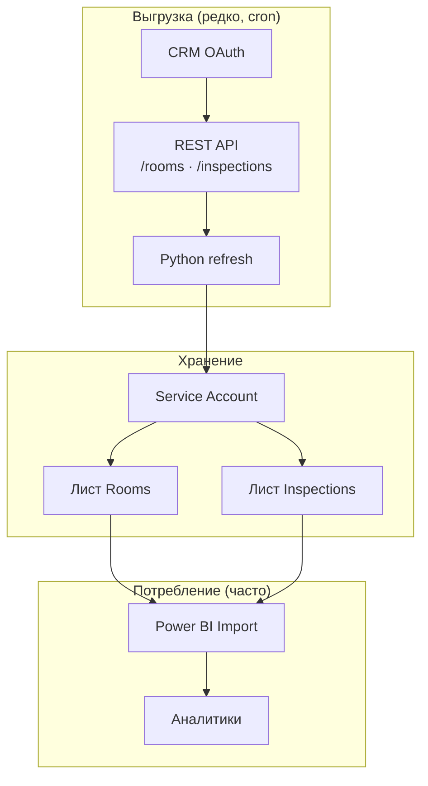
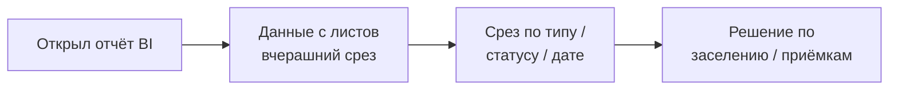
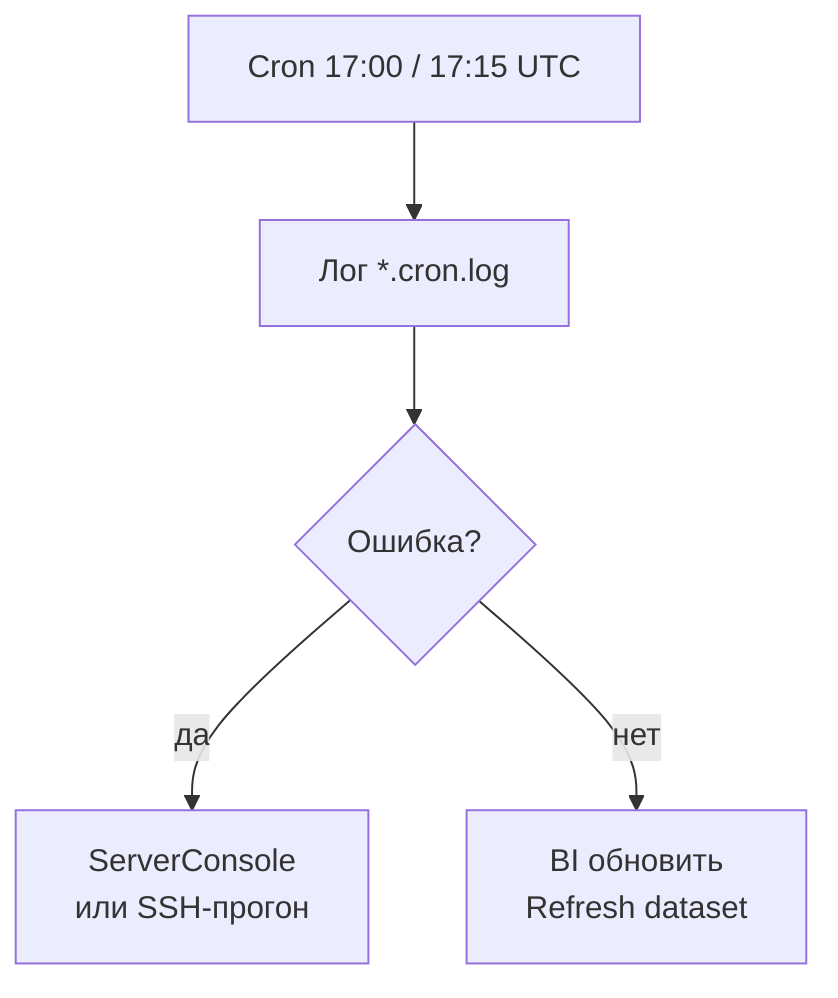

# CRM → Google Sheets → Power BI

Короче: **REST API CRM → листы таблицы → Power BI Import** по cron, без ручного Excel.

Задача: каждый день нужен один срез — помещения, приёмки, группа статуса, даты сделок. Ручная выгрузка не масштабируется; BI должен читать стабильные колонки, а не живой API.

---

## Что сделано

- **OAuth к CRM** — секреты в JSON/env, не в теле скрипта.
- **Два refresh-скрипта** — комнаты + цветовая группа; fact приёмок (строка = приёмка).
- **Общие модули** — метрики, группировка статусов, переиспользование в парсерах отчётов.
- **Cron на VPS** — вечерний прогон без участия человека.
- **Документация колонок** — стратегия BI и чеклист под срезы.

---

## Фишки и удобство

| Фишка | Зачем |
|-------|-------|
| Service Account → Sheets | BI не дергает API при каждом открытии отчёта |
| `IFLAT_COLOR_MODE` / аналог | Одна логика цвета для BI и отчётов |
| Пагинация + embed | Меньше запросов на комнату |
| Ручной refresh из бота | Внеплановый прогон без SSH |
| `.example` для секретов | Репозиторий без паролей |

**Плюс по нагрузке:** CRM вызывается **2–4 раза в сутки** (cron + ручной), не при каждом пользователе BI.

---

## Схема данных



---

## Процесс пользователя



**Администратор:**



---

## Стек

| Слой | Технология |
|------|------------|
| Источник | REST API CRM |
| ETL | Python 3, requests |
| Запись | gspread / google-auth |
| Расписание | cron на VPS |
| BI | Power BI Import |
| Секреты | JSON + env |

---

## Структура репозитория

```
README.md
LICENSE
.gitignore
rooms_refresh.py          — комнаты + цвет группы
inspections_refresh.py    — fact приёмок
crm_oauth.py              — OAuth и service account
docs/                     — BI-стратегия, DATA-SCHEMA, DIAGRAMS.md
examples/                 — crm_secrets.json.example, env.example
```

---

## Быстрый старт

```bash
export CRM_SECRETS_JSON="./path/to/crm_secrets.json"
export GOOGLE_SERVICE_ACCOUNT_JSON="./path/to/service-account.json"
python3 rooms_refresh.py
python3 inspections_refresh.py
```

На VPS — те же env в `cron.env` или unit-окружении; логи рядом со скриптом.
